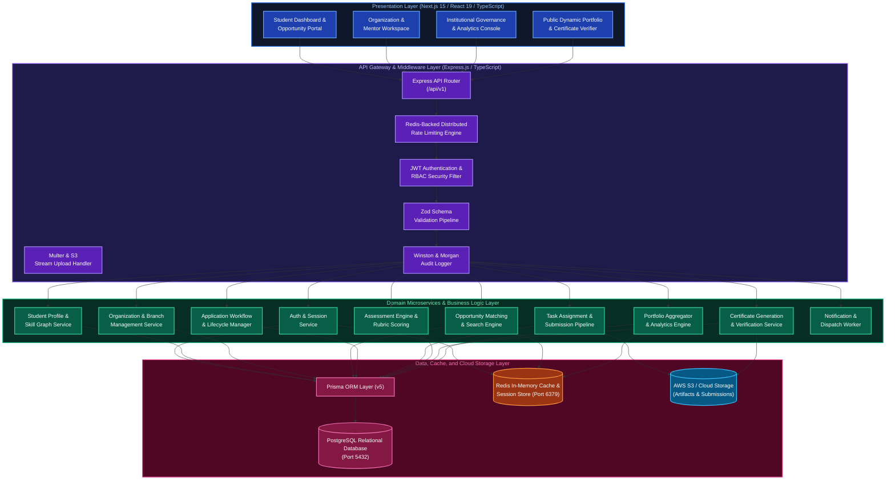
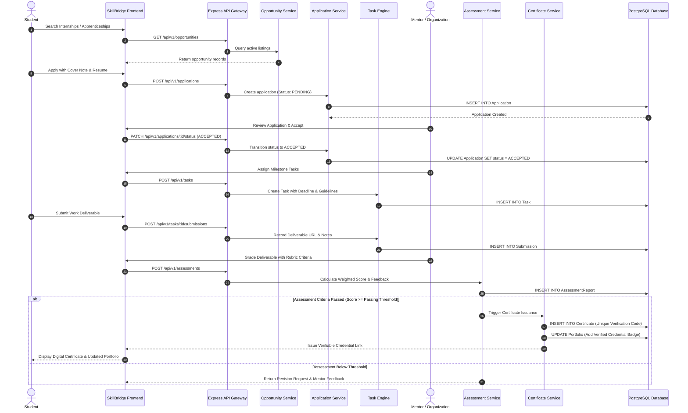
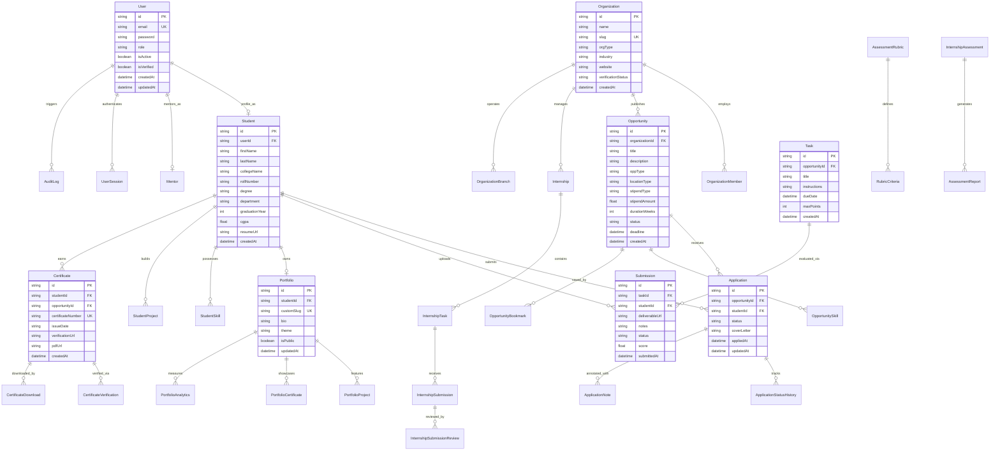

# SkillBridge

SkillBridge is an enterprise SaaS platform designed to align higher education with the National Education Policy (NEP) 2020. The platform bridges the gap between academic theory and industry employability by providing structured pathways for skill discovery, verified internships, apprenticeship management, milestone-based task evaluations, dynamic public portfolios, and cryptographically verifiable digital certificates.

---

## Table of Contents

1. [Platform Overview and NEP 2020 Alignment](#platform-overview-and-nep-2020-alignment)
2. [System Architecture](#system-architecture)
3. [UML Sequence Diagram](#uml-sequence-diagram)
4. [Database Architecture and ER Model](#database-architecture-and-er-model)
5. [Core Functional Modules](#core-functional-modules)
6. [Technology Stack](#technology-stack)
7. [Repository Structure](#repository-structure)
8. [API Reference](#api-reference)
9. [Redis Caching and Performance Architecture](#redis-caching-and-performance-architecture)
10. [Docker Orchestration and Local Setup](#docker-orchestration-and-local-setup)
11. [Security, Governance, and Verification](#security-governance-and-verification)
12. [License](#license)

---

## Platform Overview and NEP 2020 Alignment

Traditional education systems often prioritize theoretical examinations over practical industry readiness. SkillBridge operationalizes the core objectives of the National Education Policy (NEP) 2020 by establishing an integrated ecosystem for:

- **Experiential and Vocational Learning**: Connecting students with real-world industry tasks, vocational specialists, and verified apprenticeships.
- **Continuous Comprehensive Assessment**: Replacing singular exam metrics with milestone rubrics, mentor evaluations, and structured feedback loops.
- **Verifiable Skill Portfolios**: Generating dynamic, shareable digital portfolios backed by cryptographically verifiable certificates and project audit trails.
- **Institutional Governance**: Enabling colleges, universities, and training institutes to monitor student employability metrics and industry engagement rates.

---

## System Architecture

The following UML component and deployment diagram illustrates the cloud-native multi-tier architecture of SkillBridge, covering client applications, API gateways, domain services, caching, persistence, and external cloud integrations.



---

## UML Sequence Diagram

This sequence diagram illustrates the complete student journey: discovering an opportunity, submitting an application, organization review, task assignment and submission, mentor rubric assessment, and automatic certificate issuance with portfolio integration.



---

## Database Architecture and ER Model

The data layer is managed via PostgreSQL with Prisma ORM, utilizing normalized relational tables with enforced foreign key integrity and audit triggers.



---

## Core Functional Modules

### 1. Authentication and Authorization
- Multi-role support: `STUDENT`, `ORGANIZATION_ADMIN`, `MENTOR`, `INSTITUTION_ADMIN`, and `SUPER_ADMIN`.
- Stateless JWT architecture with token rotation, refresh tokens, and session tracking via Redis.
- Password encryption using bcrypt with configurable work factors.

### 2. Opportunity Discovery and Matching
- Multi-faceted filtering: Location (Remote, On-site, Hybrid), Opportunity Type (Internship, Apprenticeship, Project, Vocational Training), Domain, and Required Skill Graph.
- Bookmark, saved searches, and view analytics for opportunity publishers.

### 3. Application Lifecycle Management
- Multi-state progression: `DRAFT` -> `SUBMITTED` -> `UNDER_REVIEW` -> `SHORTLISTED` -> `INTERVIEW_SCHEDULED` -> `ACCEPTED` / `REJECTED`.
- Complete status change history logs with reviewer annotations.

### 4. Task and Milestone Management
- Structured task creation with deliverable guidelines, rubrics, and deadlines.
- Multi-file attachments and external project repository linking.
- Direct feedback and revision requests prior to final grading.

### 5. NEP-Aligned Assessment Engine
- Rubric-based scoring criteria evaluating technical execution, documentation, timeliness, and problem-solving.
- Automated grade computation and weighted performance analytics.

### 6. Digital Credentialing and Verification
- Automated certificate generation upon successful completion of required milestones.
- Unique cryptographic certificate identifiers with public URL verification routes for employers and institutions.

### 7. Dynamic Student Portfolios
- Public showcase pages aggregating verified skills, completed projects, mentor recommendations, and certificates.
- Built-in traffic analytics (profile views, unique visitors, recruiter downloads).

---

## Technology Stack

### Frontend Client
- **Framework**: Next.js 15 (App Router) / React 19
- **Language**: TypeScript 5.4+
- **Styling**: TailwindCSS
- **Icons**: Lucide React
- **Client Authentication**: Clerk React / Custom JWT Interceptor
- **Build Engine**: Vite / Next Compiler

### Backend API Server
- **Runtime**: Node.js (v20+ LTS)
- **Framework**: Express.js (v4.19+)
- **Language**: TypeScript (v5.4+)
- **ORM**: Prisma ORM (v5.15+)
- **Database**: PostgreSQL (v15+)
- **Cache & Session**: Redis (v7+)
- **Schema Validation**: Zod (v3.23+)
- **File Storage**: AWS S3 SDK / Multer Stream
- **Security & Logging**: Winston, Morgan, CORS, bcrypt, jsonwebtoken, ua-parser-js

---

## Repository Structure

```text
SkillBridge/
├── backend/                         # Express.js TypeScript Backend API
│   ├── prisma/
│   │   └── schema.prisma            # Prisma schema and relational models
│   ├── src/
│   │   ├── config/                  # Environment, database, Redis, S3 config
│   │   ├── core/                    # Base controllers, middlewares, error handlers
│   │   ├── modules/                 # Domain-driven feature modules
│   │   │   ├── applications/        # Application lifecycle controllers & services
│   │   │   ├── assessments/         # Rubric evaluation & score calculation
│   │   │   ├── auth/                # JWT auth, sessions, registration
│   │   │   ├── certificates/        # Credential issuance & verification
│   │   │   ├── notifications/       # Internal notifications & dispatch
│   │   │   ├── opportunities/       # Listings, filters, and search queries
│   │   │   ├── organizations/       # Company, university, branch management
│   │   │   ├── portfolios/          # Public portfolio builder & analytics
│   │   │   ├── students/            # Profile, education, and skill graphs
│   │   │   └── tasks/               # Milestone task assignment & submissions
│   │   ├── utils/                   # Shared helpers, formatters, validators
│   │   └── server.ts                # Application entrypoint & HTTP bootstrap
│   ├── Dockerfile                   # Multi-stage production build for backend
│   ├── package.json                 # Backend dependencies and scripts
│   └── tsconfig.json                # TypeScript compiler configuration
│
├── frontend/                        # Next.js / React Web Application
│   ├── src/                         # Source components, pages, hooks, state
│   ├── public/                      # Static assets and fonts
│   ├── Dockerfile                   # Multi-stage production build for frontend
│   ├── package.json                 # Frontend dependencies and scripts
│   └── vite.config.ts / tsconfig    # Build and compiler configurations
│
├── docs/                            # Architecture Decision Records (ADRs)
├── markdown/                        # Comprehensive specifications (PRD, HLD, LLD, BRD)
├── docker-compose.yml               # Unified multi-container orchestration
├── .gitignore                       # Repository exclusion rules
└── README.md                        # Master project documentation
```

---

## API Reference

All REST endpoints are namespaced under `/api/v1`.

### Authentication
- `POST /api/v1/auth/register` - Create user and initiate role profile.
- `POST /api/v1/auth/login` - Authenticate credentials and receive access/refresh tokens.
- `POST /api/v1/auth/refresh-token` - Renew access token using refresh token.
- `POST /api/v1/auth/logout` - Invalidate active session in Redis.

### Opportunities
- `GET /api/v1/opportunities` - Query opportunities with multi-criteria filters.
- `POST /api/v1/opportunities` - Create a new internship or apprenticeship posting.
- `GET /api/v1/opportunities/:id` - Retrieve full opportunity specification.
- `PUT /api/v1/opportunities/:id` - Update listing details.
- `DELETE /api/v1/opportunities/:id` - Archive or deactivate listing.

### Applications
- `POST /api/v1/applications` - Submit an application for an opportunity.
- `GET /api/v1/applications/student` - List all applications for current student.
- `GET /api/v1/applications/opportunity/:id` - List applicants for an opportunity.
- `PATCH /api/v1/applications/:id/status` - Transition applicant status.

### Tasks and Milestones
- `POST /api/v1/tasks` - Create milestone task for accepted candidates.
- `GET /api/v1/tasks/opportunity/:id` - List tasks assigned to an opportunity.
- `POST /api/v1/tasks/:id/submissions` - Upload deliverable submission.
- `GET /api/v1/tasks/:id/submissions` - Retrieve submissions for review.

### Assessments and Rubrics
- `POST /api/v1/assessments` - Record evaluation using structured rubric criteria.
- `GET /api/v1/assessments/student/:id` - Retrieve assessment history for student.

### Certificates and Portfolios
- `POST /api/v1/certificates/issue` - Generate verified completion certificate.
- `GET /api/v1/certificates/verify/:code` - Public verification endpoint.
- `GET /api/v1/portfolios/:slug` - Fetch public dynamic student portfolio.

---

## Redis Caching and Performance Architecture

SkillBridge utilizes Redis for high-throughput performance optimization:

1. **Session Management**: Fast token validation and instant revocation without hitting PostgreSQL on every request.
2. **Opportunity Feed Caching**: Active opportunity listings cached with time-to-live (TTL) invalidation on new publications.
3. **API Rate Limiting**: Distributed token bucket rate limiting preventing brute-force and DDoS attacks.
4. **Portfolio Read Caching**: Public portfolio pages cached in-memory with background revalidation.

---

## Docker Orchestration and Local Setup

### Prerequisites
- Docker Engine (v24.0+) & Docker Compose (v2.0+)
- Node.js (v20+ LTS)
- npm or yarn

### 1. Clone the Repository
```bash
git clone https://github.com/AviralNITW/SkillBridge.git
cd SkillBridge
```

### 2. Run with Docker Compose (Recommended)
Launch PostgreSQL, Redis, Express Backend, and Next.js Frontend with a single command:
```bash
docker-compose up --build
```

- **Frontend Application**: `http://localhost:3000`
- **Backend API Gateway**: `http://localhost:5000/api/v1`
- **PostgreSQL Database**: `localhost:5432`
- **Redis Cache Instance**: `localhost:6379`

### 3. Manual Local Development Setup

#### Backend Setup:
```bash
cd backend
npm install
cp .env.example .env
npx prisma generate
npx prisma db push
npm run dev
```

#### Frontend Setup:
```bash
cd ../frontend
npm install
npm run dev
```

---

## Security, Governance, and Verification

- **Role-Based Access Control (RBAC)**: Enforces least-privilege principles across student, mentor, and organizational boundaries.
- **Cryptographic Certificate Verification**: Every issued credential receives a SHA-256 derived verification code linked to permanent audit logs.
- **Data Protection & Sanitization**: Comprehensive input validation with Zod schemas and SQL injection protection through Prisma parameterized queries.
- **Audit Logging**: Sensitive operations (status transitions, score grading, certificate generation) written to immutable audit tables.

---

## License

This project is licensed under the ISC License. Refer to the LICENSE file for full terms.
